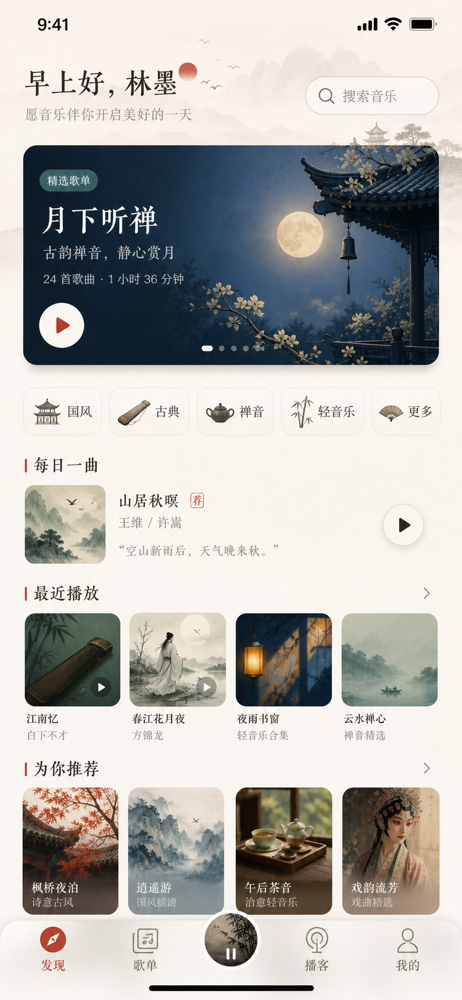
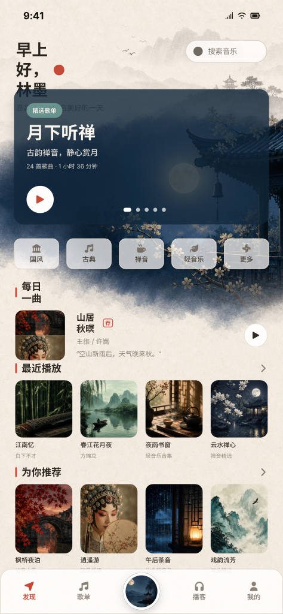
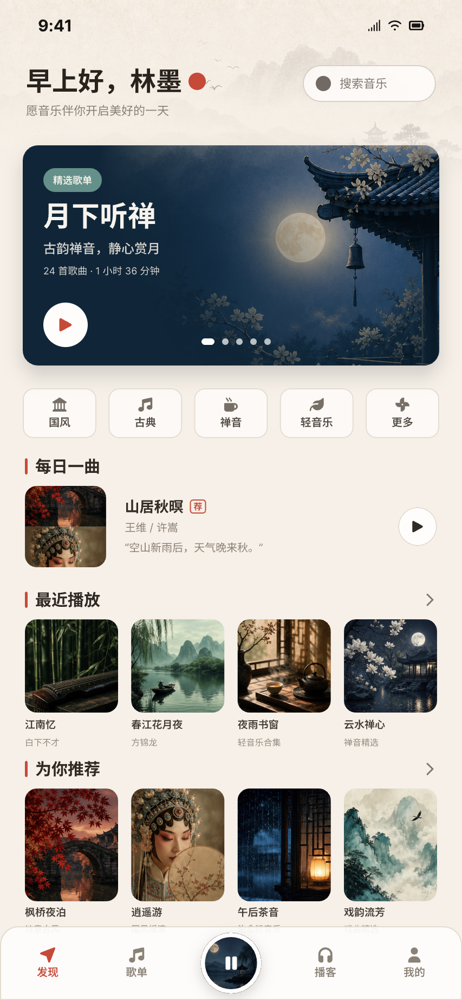
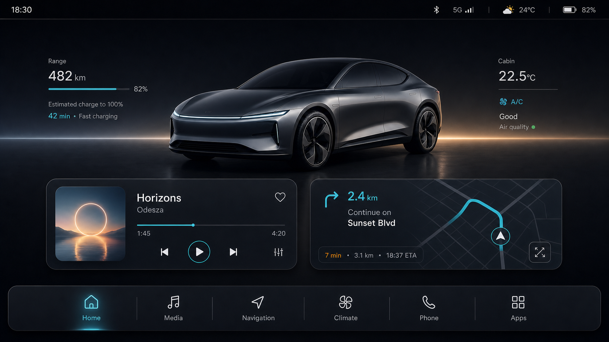
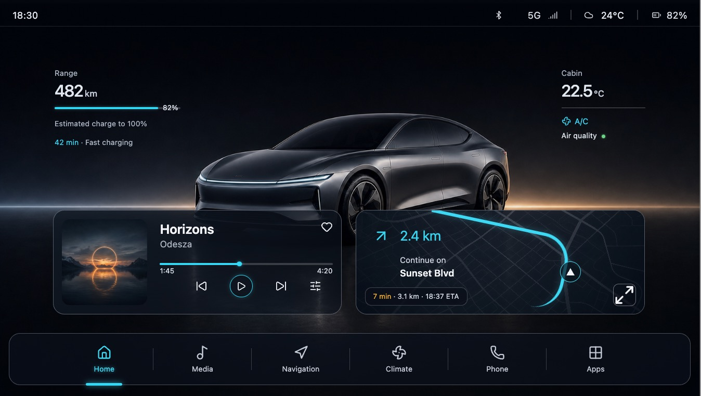
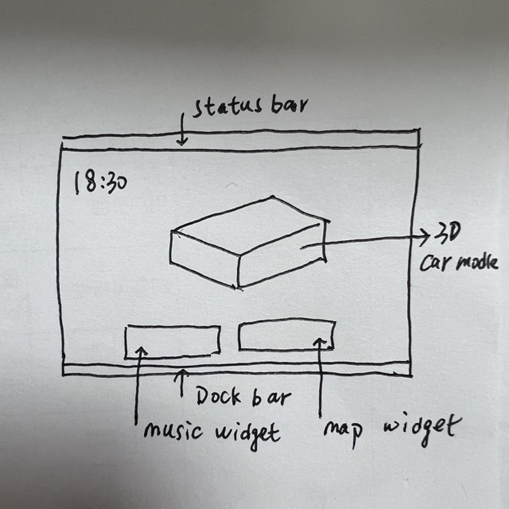
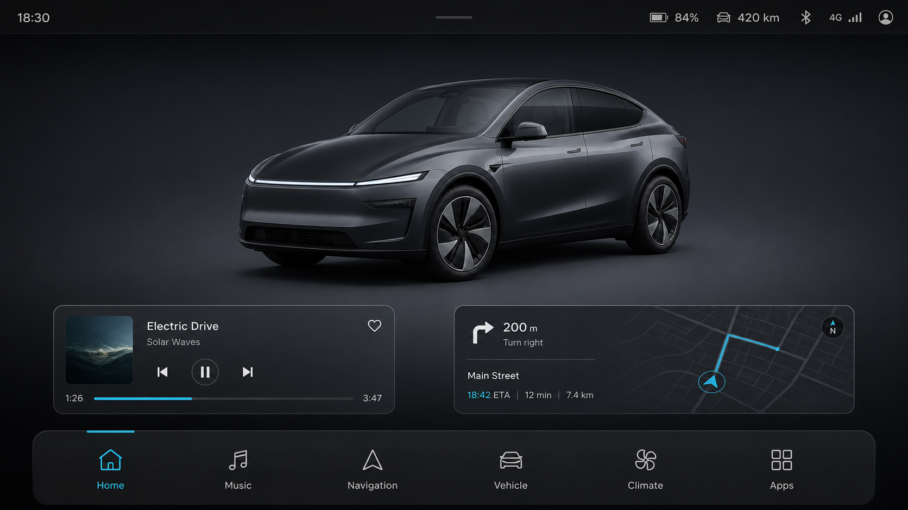
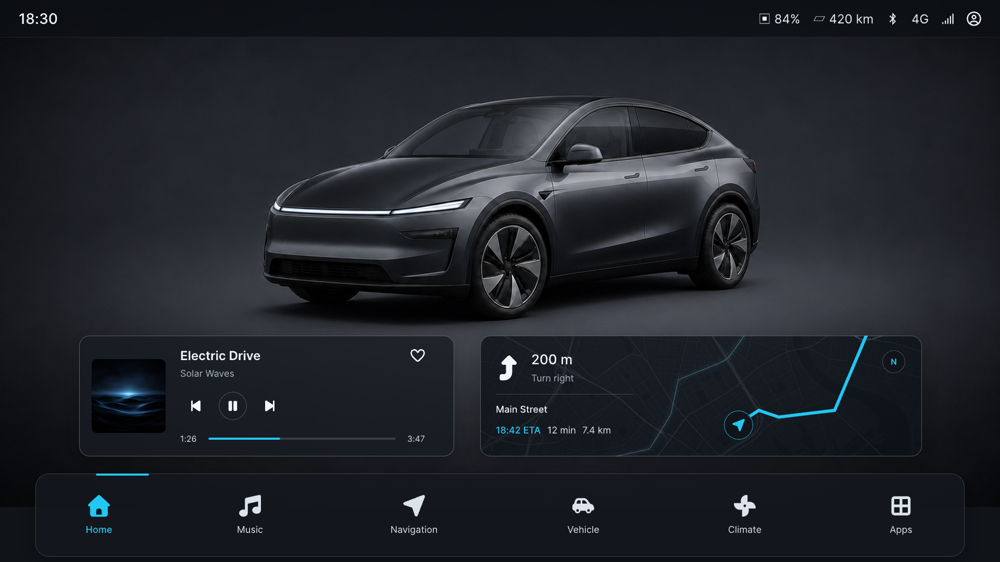
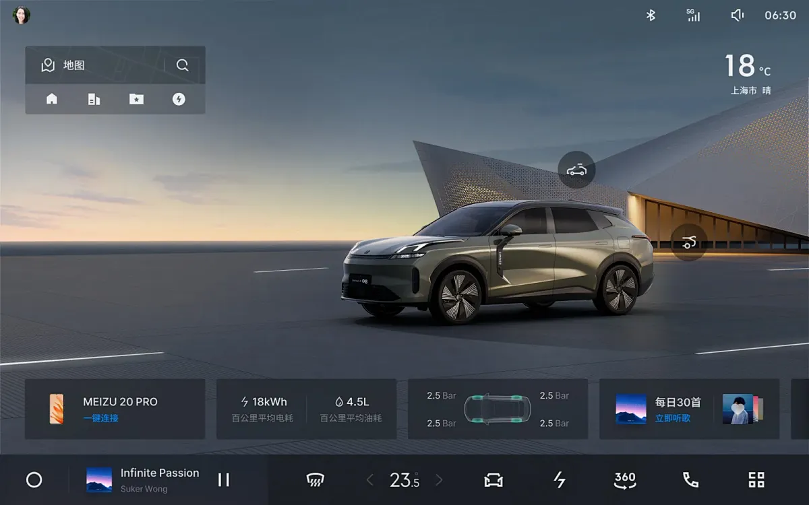
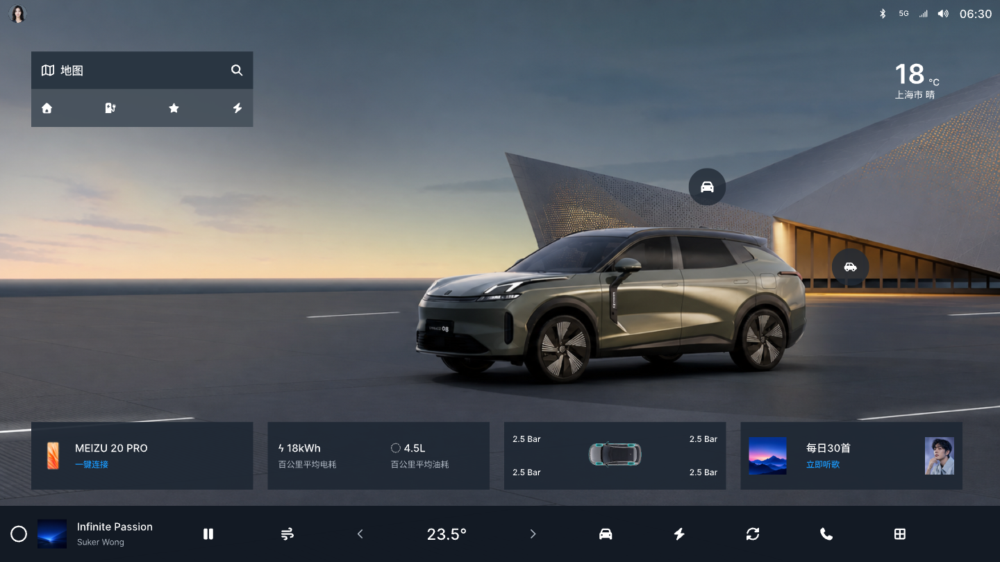

# Image to UI Skill

## 从想法、草图、截图或照片，到可编辑 UI 原稿

`image-to-ui` 帮你把一个模糊的界面想法，整理成可以继续修改的 UI 原稿。

你可以从一句话需求开始，也可以上传手绘草图、既有 UI 截图、照片或其他视觉参考。skill 会先理解你的意图，再帮助你确认视觉方向和界面结构，最后输出 HTML 原稿，或绘制到 MasterGo、Figma 等设计画布中。

它适合产品经理、设计师和需要快速验证界面方案的团队成员，也适合把已有界面整理成更容易继续编辑的设计源文件。

**Image to UI turns ideas, sketches, screenshots, photos, and visual references into editable UI drafts for HTML, MasterGo, or Figma. It guides teams through visual direction, interface breakdown, confirmation, and output so they can balance speed, fidelity, and editability.**

## 你可以从什么开始

- 一句话需求：例如“生成一个现代简约的手机音乐播放器界面”。
- 手绘稿或线框图：保留布局意图，再补全为一张可讨论的 UI 视觉参考图。
- 既有 UI 截图：复刻界面的布局、内容和视觉关系，形成可继续修改的原稿。
- 照片或其他图片：将它们作为界面主体、氛围、材质或风格参考，结合你的需求生成 UI。
- 多张参考图：分别提供布局、产品主体、配色、材质或组件参考，并说明各自要借鉴的部分。
- 纯文字 brief：从产品目标、页面内容和设备比例开始，逐步生成一张可确认的界面方案。

## 主要使用场景 & 案例展示

以下案例展示了从输入到可编辑原稿的不同路径。每个案例都保留了实际使用时的用户指令和关键结果，便于快速判断哪种方式适合你的项目。

### 1. 一句话需求 → UI 原稿 → 画布还原 → 人工修正

适合还没有草图、但想快速看到产品方向的早期探索。你只需要描述页面用途、设备形态、主要内容和希望的气质，skill 会先生成一张用于讨论的 UI 参考图。

这张图不是最终交付物，而是后续拆解和编辑的视觉起点。确认方向后，可以继续生成 HTML，或还原到 MasterGo / Figma 画布。

**用户指令**

```text
/image-to-ui 生成一个真实的，高质量的中国风音乐app主界面，iOS版
```

| AI 生成 UI 原稿 | MasterGo 还原过程稿 | AI + 人工修正终稿 |
| --- | --- | --- |
|  |  |  |

### 2. 手绘稿 → HTML 可编辑原稿

适合把会议草图、白板草图或低保真线框快速整理成可展示、可继续调整的界面。

流程通常是：手绘稿 → AI UI 参考图 → 逐项确认界面组成 → HTML 可编辑原稿。

**用户指令**

```text
/image-to-ui 生成概念汽车车机主页，比例16:9
```

| 输入草图 | AI 生成 UI 原稿 | 最终 HTML 原稿 |
| --- | --- | --- |
|  |  |  |

### 3. 手绘稿 → MasterGo 可编辑原稿

适合希望直接进入设计协作、评审和后续设计迭代的团队。skill 会先把手绘稿整理成明确的视觉方向，再将确认后的结构绘制到目标画布。

**用户指令**

```text
/image-to-ui 生成概念汽车车机主页，比例16:9
```

| 输入草图 | AI 生成 UI 原稿 | 最终 MasterGo 原稿 |
| --- | --- | --- |
|  |  |  |

### 4. 既有 UI 截图 → MasterGo 可编辑复刻稿

适合整理旧版本界面、竞品参考、历史设计稿或无法直接编辑的截图。skill 会识别截图中的布局、文字、控件、图标和图片区域，并将它们重新组织成可编辑的界面结构。

它不会把整张截图简单地贴到画布上，而是尽量将真正需要修改的部分重新整理出来，同时保留复杂视觉区域的整体观感。

**用户指令**

```text
/image-to-ui 复刻界面到mastergo
```

| 原始 UI 截图 | 最终 MasterGo 原稿 |
| --- | --- |
|  |  |

### 5. 照片、视觉素材与多张参考图 → UI 原稿

照片可以作为产品主体、场景、材质、光照或氛围参考。例如，你可以提供一张汽车照片、一张空间照片或一张产品图片，再要求生成与其匹配的车机、移动端或大屏界面。

图片负责提供视觉线索，文字需求负责说明页面用途、信息和交互意图。两者可以同时使用，也可以只提供其中一种。

### 6. 结合 brief 与多张参考图生成 UI 原稿

当一张图无法说明完整需求时，可以上传多张参考图，并分别说明：

- 哪张图参考布局；
- 哪张图参考产品主体或图片风格；
- 哪张图参考颜色、材质或组件样式；
- 哪些内容必须保留，哪些内容只作为灵感。

skill 会把这些信息和产品 brief 结合起来，先形成一个可确认的视觉方向，再进入可编辑原稿制作。

## 它会如何工作

整个过程会保留必要的确认节点，避免从一张模糊图片直接跳到一个无法修改的结果。

1. **理解需求**：明确页面用途、内容、设备比例和你希望保留的视觉重点。
2. **确认视觉方向**：如果从文字或草图开始，先生成一张视觉参考图；你可以确认、调整或重新生成方向。
3. **拆解界面**：把页面中的文字、卡片、按钮、图标、图片和重要区域逐项列出来，说明哪些部分可以独立编辑。
4. **确认拆解结果**：你可以在生成原稿前修改遗漏、层级或视觉边界。
5. **输出可编辑原稿**：确认后生成 HTML，或绘制到 MasterGo、Figma 等目标画布。
6. **检查结果**：对照参考图检查主要区域、文字、图标、图片和重复控件，发现明显缺失时再进行修正。

## 能力边界与实际工作方式

`image-to-ui` 的目标是帮助你更快从需求和参考素材走到可编辑 UI 原稿，但它不是一次输入、一次生成就能覆盖所有复杂设计的自动化工具。

- **画布平台能力**：绘制到 MasterGo 或 Figma 画布需要使用对应平台的 MCP 能力。相关 MCP 提供的方法和可编辑能力可能并不完整，不同平台和客户端对节点创建、图标、矢量、图片、读取和修改等能力也可能存在差异。
- **Skill 覆盖范围**：`image-to-ui` 覆盖的是通用的 UI 还原与原稿生成流程，并不能自动解决所有特殊组件、复杂动效、真实业务数据和平台差异。
- **复杂设计处理**：简单页面通常可以较快得到可讨论的结果；复杂设计往往需要多轮对话、画布侧调整和人工修正，以平衡处理效率、可编辑性和还原效果。
- **最终验收**：输出结果仍需要产品和设计人员进行内容、品牌、布局和平台适配验收。

## 输出方式

### HTML

生成一个可以直接在浏览器中打开的静态 HTML 原稿，适合快速预览、评审、分享，以及在没有画布连接时先完成方案确认。

### MasterGo / Figma

绘制到 MasterGo 或 Figma 画布需要使用对应画布平台的 MCP 能力。如果当前环境已经配置相关能力，直接使用 `image-to-ui` 即可；如果尚未配置，可以同时安装 [MasterGo MCP Skill](https://github.com/HicyWon/mastergo-mcp-skill) 来连接和操作 MasterGo 画布，Figma 则需要配置对应的 Figma 连接能力。

## 下载与安装

### 下载 ZIP

[下载 image-to-ui-skill ZIP 包](https://github.com/HicyWon/image-to-ui-skill/archive/refs/heads/main.zip)

### 使用 Git

```bash
git clone --depth 1 https://github.com/HicyWon/image-to-ui-skill.git
```

### 使用 Codex skill installer

```bash
python3 ~/.codex/skills/.system/skill-installer/scripts/install-skill-from-github.py \
  --url https://github.com/HicyWon/image-to-ui-skill \
  --path .
```

也可以将本仓库整体复制到目标 Agent 客户端的 skills 目录。

运行内置交付检查时需要 Python 3；使用本地图标解析脚本时需要 Node.js。

## 目录结构

```text
image-to-ui-skill/
├── SKILL.md
├── README.md
├── agents/openai.yaml
├── docs/showcase/         # 面向用户的案例和结果展示
├── references/            # 拆解、保真、确认、图标和验证规则
├── scripts/               # 图标解析与交付检查脚本
└── assets/icons/lucide/   # 本地 Lucide 图标资源
```

## 许可

本 skill 使用 MIT License。内置 Lucide 图标资源遵循 `assets/icons/lucide/LICENSE` 中的许可说明。
